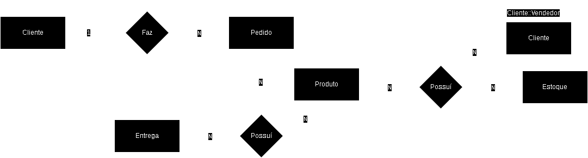
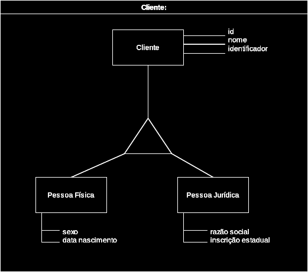
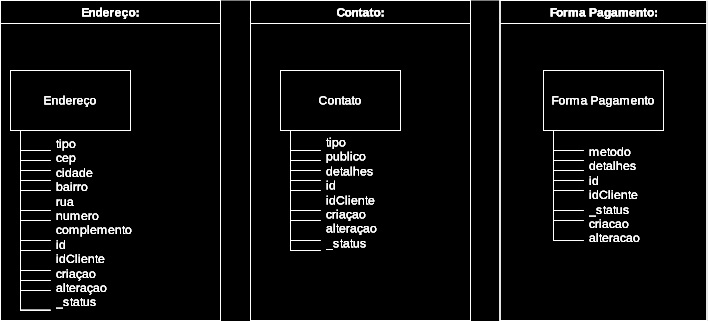
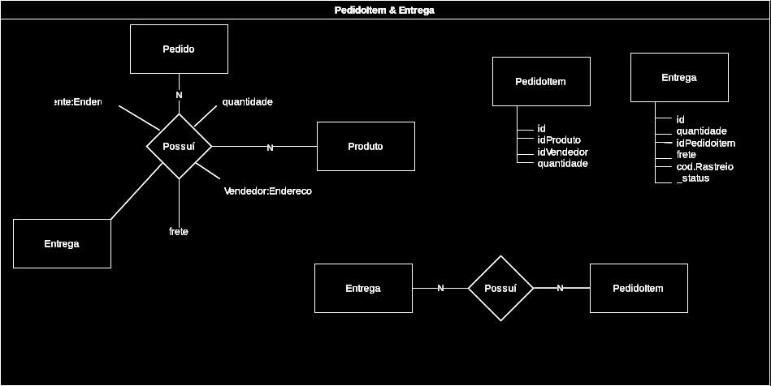
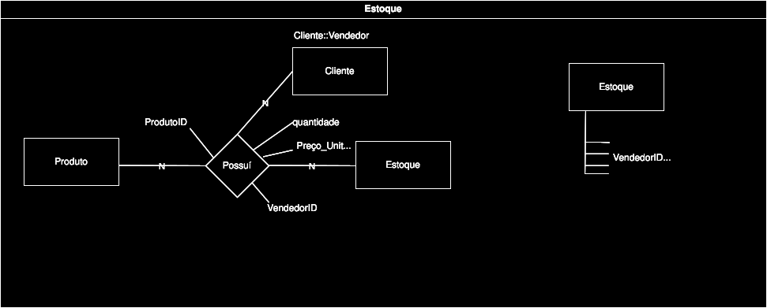
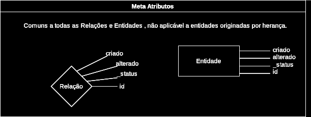
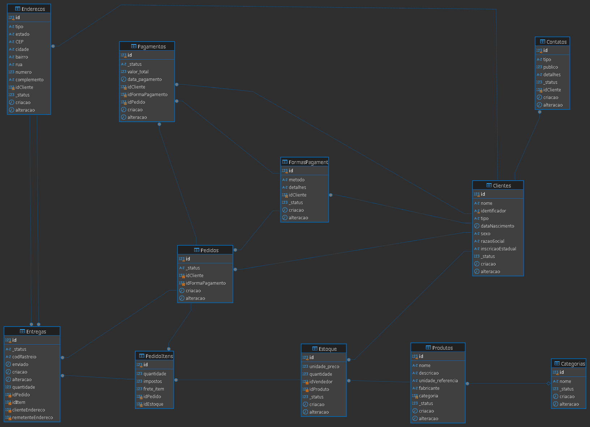

# Projeto Básico de Banco de Dados Usando MySQL 
 

## #Objetivos e Limitações

**Objetivos deste Projeto**
- Implementar um modelo de e-commecer em MySQL, como requisito para o bootcamp DIO, Suzano - Análise de Dados com Power BI, para o módulo:"Construíndo seu Primeiro Projeto Lógico de Banco de Dados".

**Limitações**
- Não foram implementados *TRIGGERS*, *STORED PROCEDURES* ou *VIEWS*, por estarem fora do escope de projeto. 👍

### Este repositório tem como objetivo:
- Implementar a modelagem lógica do cenário de e-commerce;
- Criar um script SQL para geração do esquema do banco de dados;
- Realizar inserções de dados para testes;
- Desenvolver queries SQL para validações e consultas avançadas.

## Descrição do Desafio:

Replicar a modelagem do projeto lógico de banco de dados para o cenário de e-commerce.

Definições de chave primária e estrangeira, assim como as constraints presentes no cenário modelado. 
Modelar relacionamentos presentes no modelo EER.

Aplicar o mapeamento de modelos aos refinamentos propostos no módulo de modelagem conceitual.

Criação do Script SQL para criação do esquema do banco de dados.

Persistência de dados para realização de testes. Especificação de queries mais complexas dos que apresentadas durante a explicação do desafio. 

Criação de queries SQL com as cláusulas abaixo:

- Recuperações simples com SELECT Statement
- Filtros com WHERE Statement
- Crie expressões para gerar atributos derivados
- Defina ordenações dos dados com ORDER BY
- Condições de filtros aos grupos – HAVING Statement
- Crie junções entre tabelas para fornecer uma perspectiva mais complexa dos dados

**Diretrizes**
Não há um mínimo de queries a serem realizadas;

Os tópicos supracitados devem estar presentes nas queries;

- Quais perguntas podem ser respondidas pelas consultas;
- As cláusulas podem estar presentes em mais de uma query;
- O projeto deverá ser adicionado a um repositório do Github para futura avaliação do desafio de projeto. 

- Adicione ao Readme a descrição do projeto lógico para fornecer o contexto sobre seu esquema lógico apresentado.

Objetivo:
Aplicar o mapeamento para o  cenário:

- “Refine o modelo apresentado acrescentando os seguintes pontos”

- Cliente PJ e PF – Uma conta pode ser PJ ou PF, mas não pode ter as duas informações;
- Pagamento – Pode ter cadastrado mais de uma forma de pagamento;
- Entrega – Possui status e código de rastreio;

### Algumas das perguntas que podes fazer para embasar as queries SQL:

- Quantos pedidos foram feitos por cada cliente?
- Algum vendedor também é fornecedor?
- Relação de produtos fornecedores e estoques;
- Relação de nomes dos fornecedores e nomes dos produtos;

## Estrutua Deste Projeto

<pre>
[Arquivo]                     [Conteúdo]
  ecommerce.sql            <-   DataBase 
  insercoes.sql            <-   Inserts
  teste_insercoes.sql      <-   Queries
  ecommerce_mysql.png      <-   SCHEMA MySQL
  ecommerce.png            <-   E.R.R Model 
</pre>

- Notas sobre este projeto:

<em>
    Embora a granularidade do modelo possa ser inadequada para fins práticos, optei em utilizar um modelo com granularidade elevada, os nomes das tabelas podem não ser adequadas, bem como estarem com colunas faltantes e atriutos deslocado. Não houveram Casos de uso detalhados para embasar este modelo.
  </em>

 
Ps.:CHAT GP/Gemimi foram usados exclusívamente para gerar massa de dados, e prover uma visão crítica da DataBase,
fazer algumas verificações lógicas em algumas queries, não sendo estes autores de quaisquer queries ou tabelas neste projeto, suas adições estão cinalizadas como "GTP hints".

 

Diagrama ERR: 

Generalização de Cliente: 

Entidades Auxiliares de Cliente: 

Entidades Associativas de Pedido: 

Entidades Associativas de Produto: 

Metadata: 

- Notas sobre a Implementação:

<em>
  Algumas tabelas de Junção como entre PedidoItens e Entregas: EntregasItens - foram preteridas em função da execiva granularidade e eveitar Over Design.
  </em>

 

Implemantção em MySQL: 
 