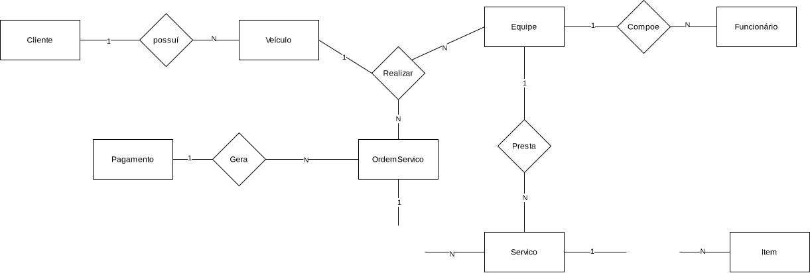
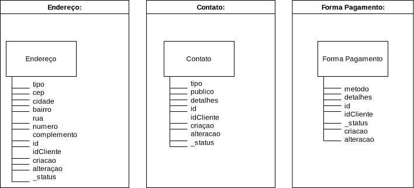
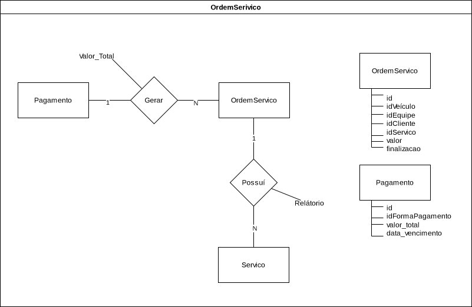
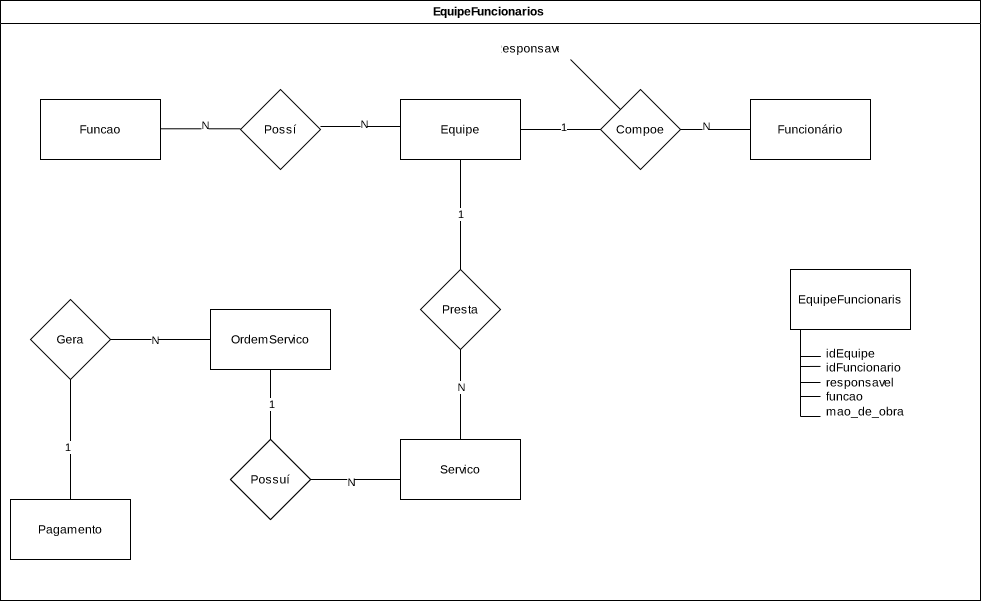
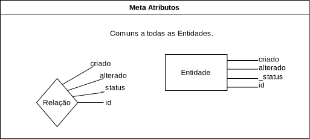
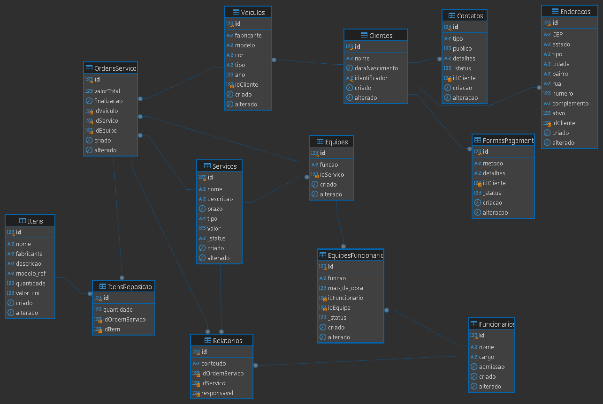

 
# Projeto Básico de Banco de Dados Usando MySQL  
 

## #Objetivos e Limitações

**Objetivos deste Projeto**
- Implementar um modelo de oficina mecânica em MySQL, como requisito para o bootcamp DIO, Suzano - Análise de Dados com Power BI, para o módulo:"Construa um Projeto Lógico de Banco de Dados do Zero".

**Limitações**
- Não foram implementados *TRIGGERS*, *STORED PROCEDURES* ou *VIEWS*, por estarem fora do escopo de projeto. 👍

### Este repositório tem como objetivo:
- Implementar a modelagem lógica do cenário de oficina mecânica;
- Criar um script SQL para geração do esquema do banco de dados;
- Realizar inserções de dados para testes;
- Desenvolver queries SQL para validações e consultas avançadas.

## Descrição do Desafio:

Replicar a modelagem do projeto lógico de banco de dados para o cenário de e-commerce.

Definições de chave primária e estrangeira, assim como as constraints presentes no cenário modelado. 
Modelar relacionamentos presentes no modelo EER.

Aplicar o mapeamento de modelos aos refinamentos propostos no módulo de modelagem conceitual.

Criação do Script SQL para criação do esquema do banco de dados.

Persistência de dados para realização de testes. Especificação de queries mais complexas do que as apresentadas durante a explicação do desafio. 

Criação de queries SQL com as cláusulas abaixo:

- Recuperações simples com SELECT Statement
- Filtros com WHERE Statement
- Crie expressões para gerar atributos derivados
- Defina ordenações dos dados com ORDER BY
- Condições de filtros aos grupos – HAVING Statement
- Crie junções entre tabelas para fornecer uma perspectiva mais complexa dos dados

**Diretrizes**
- Não há um mínimo de queries a serem realizadas;
- Os tópicos supracitados devem estar presentes nas queries;
- Elaboração de perguntas que podem ser respondidas pelas consultas
- As cláusulas podem estar presentes em mais de uma query

## Estrutura Deste Projeto

<pre>
[Arquivo]                     [Conteúdo]
  oficina.sql              <-   DataBase 
  insercoes.sql            <-   Inserts
  teste_insercoes.sql      <-   Queries
  oficina_mysql.png        <-   SCHEMA MySQL
  oficina.png              <-   EER Model 
</pre>

- Notas sobre este projeto:

<em>
    Embora a granularidade do modelo possa ser inadequada para fins práticos, optei em utilizar um modelo com granularidade elevada, os nomes das tabelas podem não ser adequadas, bem como estarem com colunas faltantes e atributos deslocados, pois não havia Casos de Uso detalhados para embasar este modelo.
  </em>

  

 
Ps.:ChatGPT/Gemini foram usados exclusivamente para gerar massa de dados e prover uma visão crítica da DataBase,
fazer algumas verificações lógicas em algumas queries, não sendo estes autores de quaisquer queries ou tabelas neste projeto, suas adições estão sinalizadas como "GTP hints".

 

Diagrama EER: 

Entidades Auxiliares de Cliente: 

Entidades Associativas de Serviços: 

Entidades Associativas de Funcionário: 

Metadata: 

- Notas sobre a Implementação:

<em>
 A escolha do design da formação de equipes é ad hoc já que não houve 
 embasamento de descrições de caso de uso, supus "Equipes" 
 temáticas com um responsável, a pessoa com maior responsabilidade 
 dentro do cenário.
</em>

 

Implemantação em MySQL: 
 