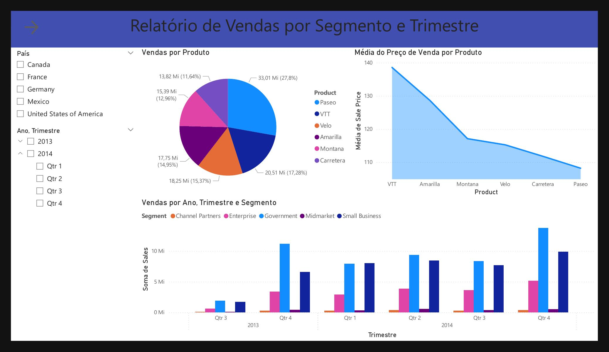
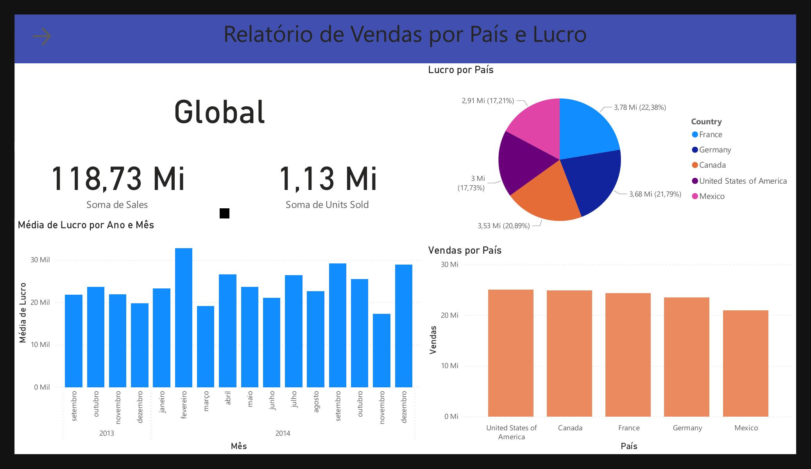
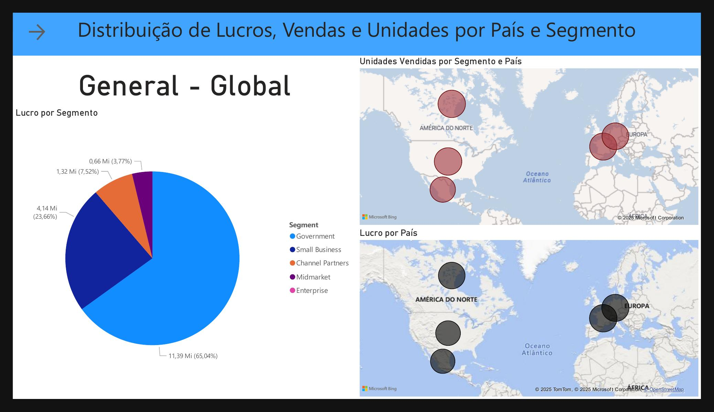
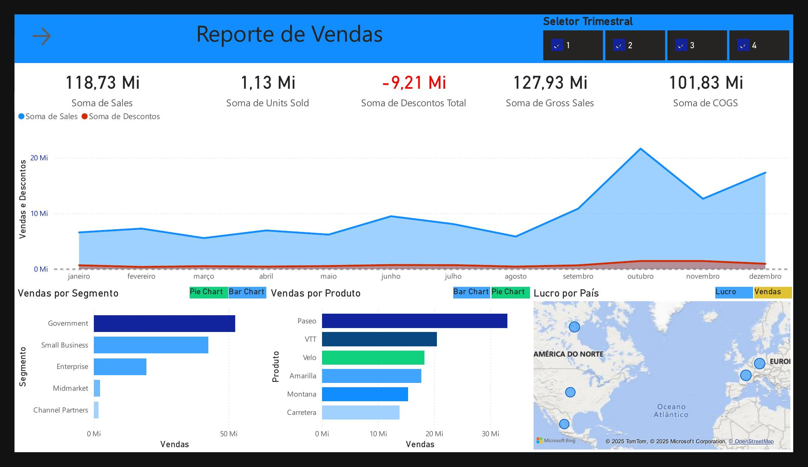
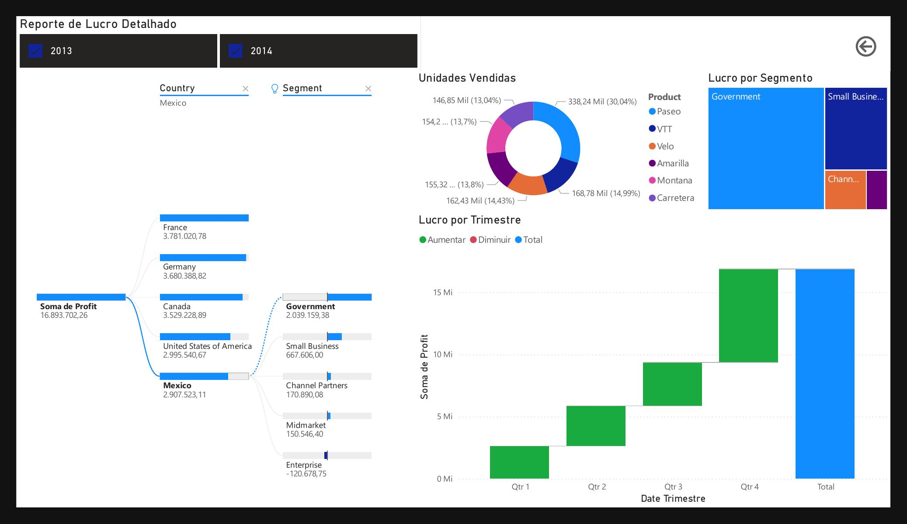

# Relatórios em Power BI 
 

## #Objetivos e Limitações

**Objetivos deste Projeto**
- Dispor das ferramentas do Microsoft Power BI Desktop para elaboração de relatórios e gráficos.

**Limitações**
- Foram minimizados ao máximo o uso de sintaxe DAX no Power BI, o tratamento dos dados foi preservado sempre que possível👍 dado que ETL estava fora do escopo.

### Este repositório tem como objetivo:
- Implementar os Relatórios usando as ferramentas do Power BI Desktop.

## Descrição do Desafio:
 
Parte 1: 
Na 3 Página do Relatório:
- Visual mapa 1: Soma de sales e unidades vendidas por país
- Visual mapa 2: Soma de lucro (profit) por país
- Visual de pizza: Lucro por segmento

Parte 2:
- Atentar a Estrutura definida
- Botões de navegação que fornecem navegabilidade
- Segmentadores utilizados e botões com imagem associado
- Utilize os indicadores e botões para selecionar diferentes visuais sobre um mesmo assunto

**Diretrizes**
- Verificar a disposição dos visuais no relatório
- Modificar os nomes dos visuais para algo mais claro e direto (de acordo com o contexto)
- Atentar aos campos que são utilizados como dicas de ferramentas *

## Estrutura Deste Projeto

<pre>
[Arquivo]                            [Conteúdo]
  Auto.pbix                      <-   Relatórios - PowerBI
  dataset/*                      <-   Dados para os Relatórios
  fig/*                          <-   Imagens dos Relatórios
</pre>

- Notas sobre este projeto:

<em>
    A sintaxe DAX, não foi foco deste projeto sendo usada somente em elementos estritamente visuais, com letreiro para descritores.
</em>

 

## Sobre os dados no dataset: 

### Descrição da Financial:

---

| Coluna                | Tipo           | Observações                      |
|-----------------------|:--------------:|----------------------------------|
| Segment               | object         | String                           |
| Country               | object         | String                           |
| Product               | object         | String                           |
| Discount Band         | object         | String, Métrica Interna          |
| Units Sold            | float64        | Integer, Unidades Vendidas       |
| Manufacturing Price   | int64          | Métrica Interna                  |
| Sale Price            | int64          | Métrica Interna                  |
| Gross Sales           | float64        | Valor Nominal                    |
| Discounts             | float64        |                                  |
| Sales                 | float64        |                                  |
| COGS                  | float64        | Métrica Interna                  |
| Profit                | float64        |                                  |
| Date                  | datetime64[ns] |                                  |
| Month Number          | int64          |                                  |
| Month Name            | object         | String                           |
| Year                  | int64          |                                  |
| Dates_Quarter         | object         | String, Trimestre                |

---

### Valores negativos no Dataset, cujo tratamento é possivelmente problemático:  

### `df_financial.groupby(['Segment', 'Country'])['Profit'].sum()`  

<table>
    <h2>Segement = 'Enterprise'</h2>
  <thead>
    <tr>
      <th></th>
      <th>Country</th>
      <th>Profit</th>
    </tr>
  </thead>
  <tbody>
    <tr><td>#</td><td>Canada</td><td>-121508.750</td></tr>
    <tr><td>#</td><td>France</td><td>-95749.375</td></tr>
    <tr><td>#</td><td>Germany</td><td>-101473.750</td></tr>
    <tr><td>#</td><td>Mexico</td><td>-120678.750</td></tr>
    <tr><td>#</td><td>United States of America</td><td>-175135.000</td></tr>
  </tbody>
</table>

## Do Power BI 

### Na importação dos dados

#### Renomeação automática de tabela, no caso remoção de espaço: 
`financials = Table.RenameColumns(#"Tipo Alterado",{{" Sales", "Sales"}})`

#### Remoção automática de dados problemáticos para a visualização, no caso uma gráfico pie do Lucro proveniente dos segmentos de mercado:

### O impacto nos gráficos é mascarado, dado a reprodução fidedigna do exemplo no curso:
O segmento "O Prejuízo do Segmento Enterprise Desaparece do gráfico"

- Notas sobre a Implementação:

<em>
 A interpretação do gráfico PIE fica vaga, a ausência de um fatia "Enterprise" passa despercebido, pode-se interpretar que foi nulo o lucro 0%, no entanto houve Prejuízo para o segmento.
  </em>

 

Visão Final do Dashboard: 

